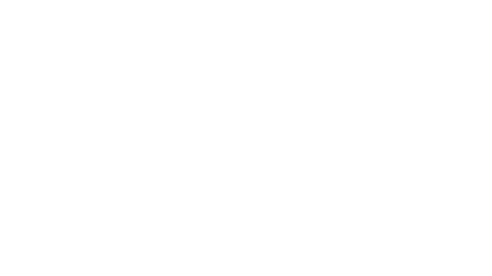

# RADPAIR German Medical Transcription UI

Real-time German medical transcription with AI-powered polish processing.



## 🚀 Quick Start

### Prerequisites
- Node.js 18+ (for Vercel deployment)
- Python 3.8+ (for backend server)
- Gemini API key

### Frontend Deployment (Vercel)

[](https://vercel.com/new/clone?repository-url=https://github.com/RADPAIR/radpair-german-data-ui)

1. Click the button above
2. Set environment variable: `NEXT_PUBLIC_WS_URL` to your backend WebSocket URL
3. Deploy!

### Backend Setup

```bash
# Clone repository
git clone https://github.com/RADPAIR/radpair-german-data-ui.git
cd radpair-german-data-ui/backend

# Install dependencies
pip install -r requirements.txt

# Set environment variables
cp .env.example .env
# Edit .env and add your GEMINI_API_KEY

# Run server
python server_radpair.py
```

## 🎯 Features

- ✅ **Real-time German transcription** with Gemini Live
- ✅ **Intelligent polish processing** with Gemini Flash Lite
- ✅ **287 German medical study types** (placeholder - integrate with RADPAIR API)
- ✅ **Medical macro expansion** (placeholder - awaiting German macros)
- ✅ **Audio archival** - WAV format per turn
- ✅ **Dark mode UI** with RADPAIR branding
- ✅ **WebSocket communication** for low latency

## 📁 Project Structure

```
radpair-german-data-ui/
├── frontend/                # Vercel-deployable frontend
│   ├── index.html          # Main UI (dark mode)
│   ├── app.js             # Frontend logic
│   └── styles.css         # Styles with Comfortaa font
├── backend/               # Python backend server
│   ├── server_radpair.py  # FastAPI WebSocket server
│   ├── requirements.txt   # Python dependencies
│   └── src/              # Core components
│       └── core_components_audio_german.py
├── public/               # Static assets
│   └── RADPAIR-LOGO-WHITE.png
├── data/                 # Placeholder data
│   ├── German_studies.text  # 287 study types (PLACEHOLDER)
│   ├── macros.csv          # English macros (PLACEHOLDER)
│   └── macros_german.csv   # German macros (TODO)
├── vercel.json          # Vercel configuration
├── package.json         # Node dependencies
└── .env.example        # Environment template
```

## 🔌 Integration Points

### Study Types API (PLACEHOLDER)
Currently loads from `German_studies.text`. Replace with RADPAIR API:

```python
# backend/server_radpair.py - Line 67-76
def load_study_types(self):
    # TODO: Replace with RADPAIR API
    # response = requests.get('https://api.radpair.com/v1/study-types/de')
    # return response.json()['study_types']
```

### German Macros (PLACEHOLDER)
Currently uses English macros. Add German medical macros:

```csv
# data/macros_german.csv (TODO: Create this file)
phrase,expanded_text
appendix,Die Appendix zeigt keine Entzündungszeichen.
nieren,Die Nieren sind normal groß und zeigen normale Echogenität.
```

## 🚀 Deployment

### Frontend (Vercel)

1. Fork this repository
2. Import to Vercel
3. Set environment variables:
   ```
   NEXT_PUBLIC_WS_URL=wss://your-backend.herokuapp.com/ws
   ```
4. Deploy!

### Backend (Heroku/Railway)

Create `Procfile`:
```
web: uvicorn backend.server_radpair:app --host 0.0.0.0 --port $PORT
```

Deploy:
```bash
heroku create radpair-backend-german
heroku config:set GEMINI_API_KEY=your_key
git push heroku main
```

## 🔧 Configuration

### Environment Variables

**Frontend (.env.local)**:
```env
NEXT_PUBLIC_WS_URL=ws://localhost:8768/ws
```

**Backend (.env)**:
```env
GEMINI_API_KEY=your_gemini_api_key_here
SERVER_PORT=8768
```

## 🧪 Testing

### Local Development
```bash
# Terminal 1: Backend
cd backend
python server_radpair.py

# Terminal 2: Frontend
cd frontend
npm run dev
```

Visit: http://localhost:3000

### Test Checklist
- [ ] WebSocket connects
- [ ] Study types load
- [ ] German transcription works
- [ ] Polish completes < 2 seconds
- [ ] Audio files saved
- [ ] UI responsive

## 📊 Performance

- **Transcription**: Real-time with Gemini Live
- **Polish**: < 2 seconds with Gemini Flash Lite
- **Audio**: 16kHz, 16-bit, mono PCM
- **WebSocket**: Low latency communication

## 🔒 Security

- API keys stored in environment variables
- WebSocket authentication (TODO)
- HTTPS/WSS in production
- No sensitive data in repository

## 📝 License

Proprietary - RADPAIR © 2025

## 🤝 Contributing

Please contact the RADPAIR team before contributing.

## 📧 Support

For issues or questions: support@radpair.com

---

**Note**: This is a beta version. Study types and macros are placeholders pending integration with RADPAIR backend services.